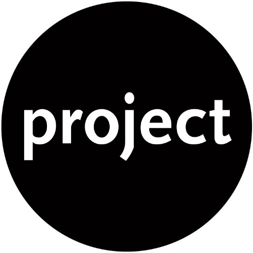

<p align="center">
  <a href="" rel="noopener">
  </a>
</p>

<h3 align="center">Project Title</h3>

<div align="center">

[](https://sites.google.com/wearecogworks.com/cogworks-handbook/clients/template-client-landing) [](https://github.com/thecogworks/cog-project-boilerplate/releases) [](../LICENSE.md)

Handbook: https://sites.google.com/wearecogworks.com/cogworks-handbook/clients

</div>

---

##### Links for static environments

-   [Staging](http://canadalife.netlify.com) [](https://app.netlify.com/sites/canadalife/deploys)
-   [Client UAT](http://canadalife-uat.netlify.com) [](https://app.netlify.com/sites/canadalife-uat/deploys)

---

## Quick start:

### Prerequisites

What things you need to install the software and how to install them.

-   NVM or Node.js
-   Lastest Nodejs version

Install latest version

```bash
nvm install latest
```

Use specific node version

```bash
nvm use <version>
```

### Development

`$ npm run start` or `$ npm start`

### Build

`$ npm run build`

This command will compile, transpile, concatenate and minimalize sources and copy them to **dist** directory.

### Build & Publish

`$ npm run publish`

This command do the same as **build** but copy files to path that is set in .publish file (it should be path to your project directory like f.e. Source/CanadaLife.Web). It doesn't copy html files.

### E2E Tests

`$ npx cypress open`

---

## Code Style

To decrease number of bugs, keep high quality of code and save the time on Pull Requests we use linters in JS and CSS.

##### JavaScript

We use [ESLint](https://eslint.org/) with [StandardJS convention](https://standardjs.com/) for code style standards and Webpack as JS boundler as the loader for ESLint [eslint-loader](https://github.com/webpack-contrib/eslint-loader).

We are using also [eslint-friendly-formatter](https://github.com/royriojas/eslint-friendly-formatter) to make the output from ESLint more human readable in the console.

This is example of our **.eslintrc.js**:

```javascript
module.exports = {
    env: {
        browser: true,
        node: true,
    },
    parserOptions: {
        ecmaVersion: "2019",
        sourceType: "module",
    },
    extends: ["standard", "plugin:vue/recommended"],
    rules: {
        "vue/no-v-html": "off",
    },
};
```

More configuration details in files:

- [eslint](Frontend/.eslintrc.js)
- [webpack](Frontend/webpack.config.js)

##### CSS

We use [stylelint](https://stylelint.io/) in CSS. To make it work with Webpack we use [stylelint-webpack-plugin](https://www.npmjs.com/package/stylelint-webpack-plugin) together with [stylelint-config-sass-guidelines](stylelint-config-sass-guidelines) which is a stylelint config based on [sass-guidelin.es](https://sass-guidelin.es/) and it works well with SCSS syntax.

Example of our .stylelintrc:

```javascript
{
  "plugins": [
    "stylelint-scss"
  ],
  "rules": {
    "block-no-empty": null,
    "color-no-invalid-hex": true,
    "comment-empty-line-before": [ "always", {
      "ignore": ["stylelint-commands", "after-comment"]
    } ],
    "declaration-colon-space-after": "always",
    "indentation": [2, {
      "except": ["value"]
    }],
    "max-empty-lines": 2,
    "rule-empty-line-before": [ "always", {
      "except": ["first-nested"],
      "ignore": ["after-comment"]
    } ],
    "unit-whitelist": ["em", "rem", "%", "s", "px", "vh", "vw", "deg", "fr"]
```

More configuration details in files:

- [stylelintrc](.stylelintrc)
- [stylelintignore](.stylelintignore)

---

See the [FE Starterkit Documentation Page](https://cog-docs.netlify.com/dev/frontend/starterkit.html) for more details.
